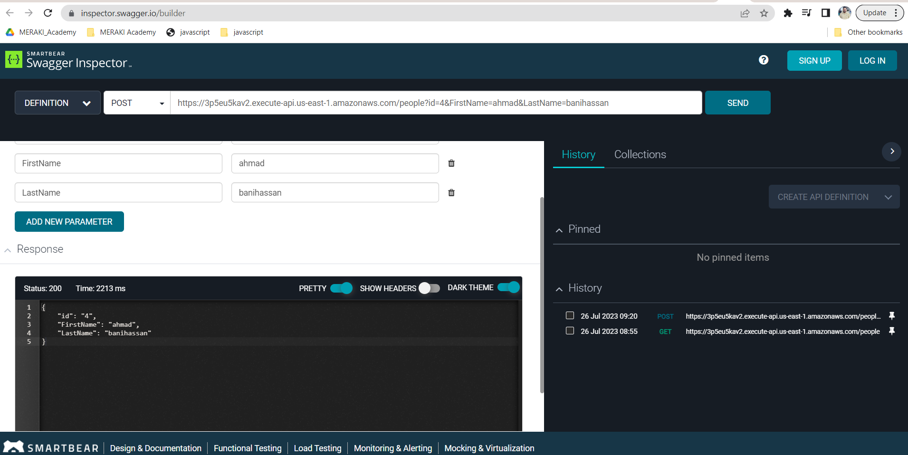

# serverless-api

first i created the data bases using dynamoDB\
\

i created the routes for my databases\
\

the created the lambda function and connected it to the API GATEWAY\
\

I added the items to the databases\
\

i uploded the ziped file to the lambda function the tested the get route\
\

i did the process again for the post route and tested the route\
\

\

